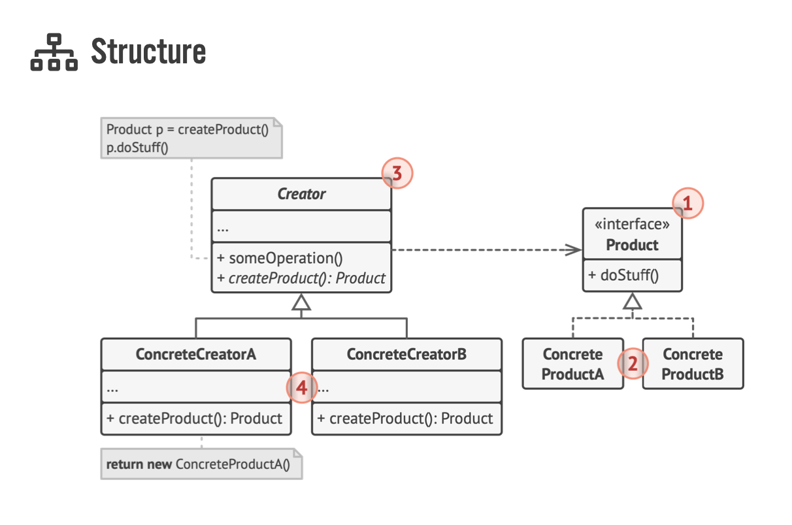

# Creational Design Patterns (1) - Factory Method

Creational design patterns provide various object creation mechanisms, which increase flexibility and reuse of existing code:
- Factory method: provides an interface for creating objects in a superclass, but allows subclasses to alter the type of objects that will be created
- Abstract Factory: Lets your produce families of related objects without specifying their concrete classes
- Builder: Lets you construct complex objects step by step. The pattern allows you to produce different types and representations of an object using the same construction code 
- Prototype: Lets you copy existing objects without making your code dependent on their classes
- Singleton" Lets you ensure that a class has only one instance, while providing a global access point to this instance

---

# Factory Method
Factory method is a creational design pattern that provides an interface for creating objects in a superclass, but allows subclasses to alter the type of objects that will be created
Here are what the structure looks like:


- The Product declares the interface, which is common to all objects that can be produced by the creator and its subclasses
- Concrete Products are different implementation of the product interface
- The Creator class declares the factory method that returns new product objects. It's important that the return type of this method matches the product interface
- You can declare the factory methods as ```@abstractmethod``` to force all subclasses to implement their own versions of the method
- Concrete Creators override the base factory method so it returns a different type of product. 

Here's my example of Transportation and Transportation Factory
- I have the main product ```Transportation``` and its subclasses are ```Car``` and ```Truck```. ```Car``` and ```Truck``` have to implement methods like ```start_engine``` and ```display_info``` but they can specify their method to match the car's and truck's attributes
- ```TransportaionFactory``` is used as an interface that create Transportation. User can just give some info make, model, year, color, etc then it can be classified as either Car or Truck later
- ```CarFactory``` and ```TruckFactory``` return Car or Truck objects as required

```python title="transportation.py"
from abc import ABC, abstractmethod


class Vehicle(ABC):
    def __init__(self,  make: str, model: str, year: int, color: str):
        self.make = make
        self.model = model
        self.year = year
        self.color = color

    @abstractmethod
    def start_engine(self) -> None:
        pass

    @abstractmethod
    def display_info(self) -> None:
        pass


class Car(Vehicle):
    def start_engine(self) -> None:
        print("CAR engine starting...")

    def display_info(self) -> None:
        print(f"---Car Info---\n"
              f"Make: {self.make}\n"
              f"Model: {self.model}\n"
              f"Year: {str(self.year)}\n"
              f"Color: {self.color}")


class Truck(Vehicle):
    def start_engine(self) -> None:
        print("TRUCK engine starting...")

    def display_info(self) -> None:
        print(f"---Truck Info---\n"
              f"Make: {self.make}\n"
              f"Model: {self.model}\n"
              f"Year: {str(self.year)}\n"
              f"Color: {self.color}")


class VehicleFactory(ABC):
    @abstractmethod
    def create_vehicle(self, make, model, year, color) -> Vehicle:
        pass


class CarFactory(VehicleFactory):
    def create_vehicle(self, make, model, year, color) -> Vehicle:
        return Car(make, model, year, color)


class TruckFactory(VehicleFactory):
    def create_vehicle(self, make, model, year, color) -> Vehicle:
        return Truck(make, model, year, color)


def client_code(vehicle_factory: VehicleFactory):
    vehicle = vehicle_factory.create_vehicle("Honda", "Civic", 2021, "Red")
    vehicle.start_engine()
    vehicle.display_info()


if __name__ == "__main__":
    car_factory = CarFactory()
    client_code(car_factory)

    truck_factory = TruckFactory()
    client_code(truck_factory)
```
```
Output:
CAR engine starting...
---Car Info---
Make: Honda
Model: Civic
Year: 2021
Color: Red
TRUCK engine starting...
---Truck Info---
Make: Honda
Model: Civic
Year: 2021
Color: Red
```

Another example of Appliance that I coded out to understand this concept better:

```python title="home_appliance.py"
from abc import ABC, abstractmethod


class Appliance(ABC):
    def __init__(self, brand: str, model: str, color: str, price: float) -> None:
        self.brand = brand
        self.model = model
        self.color = color
        self.price = price

    @abstractmethod
    def display_info(self) -> None:
        pass

    @abstractmethod
    def turn_on(self) -> None:
        pass

    @abstractmethod
    def turn_off(self) -> None:
        pass


class Television(Appliance):
    def display_info(self) -> None:
        print("---Television Info---\n"
              f"Brand: {self.brand}\n"
              f"Model: {self.model}\n"
              f"Color: {self.color}\n"
              f"Price: {self.price}\n")

    def turn_on(self) -> None:
        print("Turning on Television...")

    def turn_off(self) -> None:
        print("Turing off Television...")


class Cooker(Appliance):
    def display_info(self) -> None:
        print("---Cooker Info---\n"
              f"Brand: {self.brand}\n"
              f"Model: {self.model}\n"
              f"Color: {self.color}\n"
              f"Price: {self.price}\n")

    def turn_on(self) -> None:
        print("Turning on Cooker...")

    def turn_off(self) -> None:
        print("Turning off Cooker...")


class ApplianceFactory(ABC):
    @abstractmethod
    def create_appliance(self, brand: str, model: str, color: str, price: float) -> Appliance:
        pass


class TelevisionFactory(ApplianceFactory):
    def create_appliance(self, brand: str, model: str, color: str, price: float) -> Appliance:
        return Television(brand=brand, model=model, color=color, price=price)


class CookerFactory(ApplianceFactory):
    def create_appliance(self, brand: str, model: str, color: str, price: float) -> Appliance:
        return Cooker(brand=brand, model=model, color=color, price=price)


def client_code(appliance_factory: ApplianceFactory):
    appliance = appliance_factory.create_appliance(brand="LG", model="Electric Smart", color="black", price=800)
    appliance.turn_on()
    appliance.display_info()
    appliance.turn_off()


if __name__ == "__main__":
    cooker_factory = CookerFactory()
    client_code(cooker_factory)
    
```
```
Output:
Turning on Cooker...
---Cooker Info---
Brand: LG
Model: Electric Smart
Color: black
Price: 800

Turning off Cooker...
```

## Applicability
- Use the Factory Method when you don't know beforehand the exact types and dependencies of the objects your code should work with
- The Factory Method separates product construction code from the code that actually uses the product. Therefore, it's easier to extend the product construction code independently from the rest of the code
- Use the Factory Method when you want to provide users of your library or framework with a way to extend its internal components
- Use the Factory Method when you want to save system resources by reusing existing objects instead of rebuilding them each time

## Pros and Cons
### Pros
- You avoid tight coupling between the creator and the concrete products
- Single Responsibility Principle. You can move the product creation code into one place in the program, making the code easier to support
- Open and Closed Principle. You can introduce new types of products into the program without breaking existing client code

### Cons
- The code may become more complicated since you need to introduce a lot of new subclasses to implement the pattern. The best case scenario is whenyou're introducing the pattern into an existing hierarchy of creator classes.
