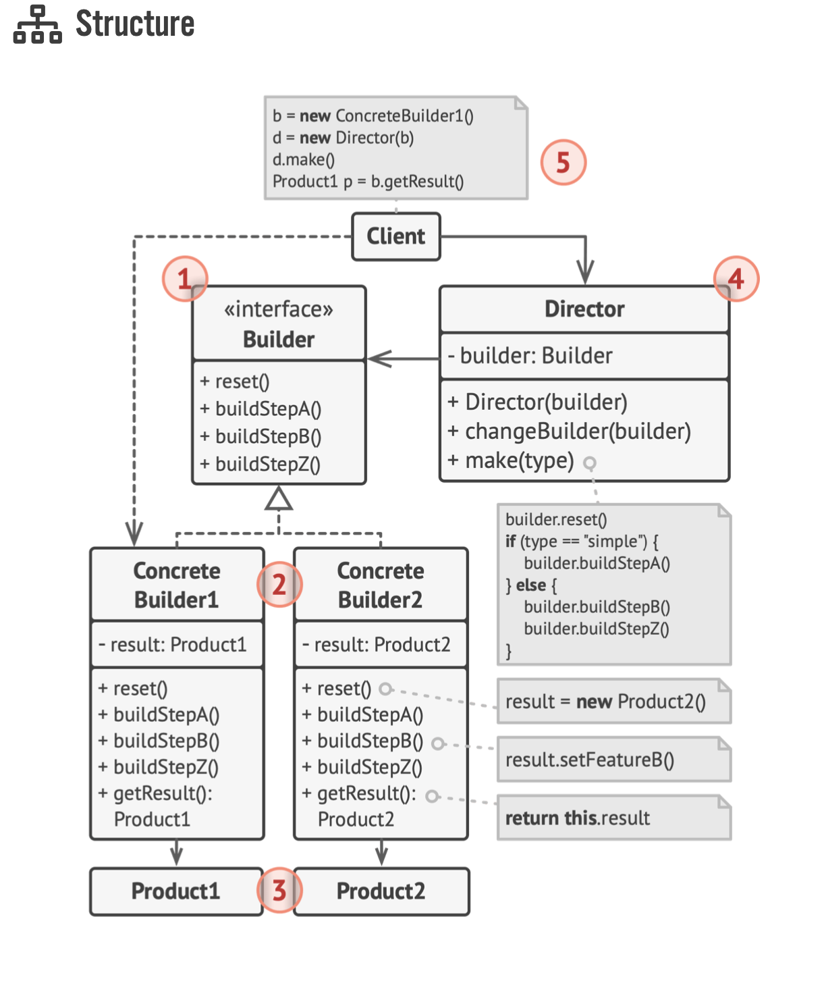

# Creational Design Patterns (3) - Builder

- Buider is a creational design pattern that lets you construct complex objects step by step. The pattern allows you to produce different types and representations of an object using the same construction code
- The Builder pattern suggests that you extract the object construction code out of its own class and move it to separate objects called <b>builders</b>
- Here's the structure of Builder pattern:


- Here's my code when following the structure:
```python
from abc import ABC, abstractmethod


class Car:
    def __init__(self, builder):
        self.seats = builder.seats
        self.engine = builder.engine
        self.trip_computer = builder.trip_computer
        self.GPS = builder.GPS

    def __str__(self):
        return f"This car has {self.seats} seats, {self.engine} engine, {self.trip_computer} trip computer."


class CarManual:
    def __init__(self, builder):
        self.seats = builder.seats
        self.engine = builder.engine
        self.trip_computer = builder.trip_computer
        self.GPS = builder.GPS

    def __str__(self):
        return f"This is the CAR MANUAL for a car with {self.seats} seats, {self.engine} engine, {self.trip_computer} trip computer."


class Builder(ABC):
    def __init__(self):
        self.seats = None
        self.engine = None
        self.trip_computer = None
        self.GPS = None

    @abstractmethod
    def setSeats(self, seats: int):
        pass

    @abstractmethod
    def setEngine(self, engine: str):
        pass

    @abstractmethod
    def setTripComputer(self):
        pass

    @abstractmethod
    def setGPS(self):
        pass


class CarBuilder(Builder):
    def setSeats(self, seats: int):
        self.seats = seats
        return self

    def setEngine(self, engine: str):
        self.engine = engine
        return self

    def setTripComputer(self):
        self.trip_computer = "Some trip computer instruction?"
        return self

    def setGPS(self):
        self.GPS = "Active GPS"
        return self

    def get_result(self) -> Car:
        return Car(self)


class CarManualBuilder(Builder):
    def setSeats(self, seats: int):
        self.seats = seats
        return self

    def setEngine(self, engine: str):
        self.engine = engine
        return self

    def setTripComputer(self):
        self.trip_computer = "Some trip computer instruction for Car Manual"
        return self

    def setGPS(self):
        self.GPS = "Active GPS for Car Manual"
        return self

    def get_result(self) -> CarManual:
        return CarManual(self)


def main():
    car_builder = CarBuilder()
    car = car_builder.setSeats(seats=4).setEngine("V8").setGPS().get_result()
    print(car)
    print(car.GPS)
    car_manual_builder = CarManualBuilder()
    car_manual = car_manual_builder.setSeats(8).setEngine("V100").setGPS().get_result()
    print(car_manual)


if __name__ == "__main__":
    main()

```

## Applicability
- Use the Builder pattern to get rid of a "telescoping constructor"
- The Builder pattern lets you build onbjects step by step, using only those stesp that you really need.
    - For example with my code above, I can only set the seats and GPS if I want to, not all attributes are required to be defined.
- Use the Builder pattern when you want your code to be able to create different representations of some product

## Pros and Cons
### Pros
- You can construct objects step by step, defer construction steps or run steps recursively
- You can reuse the same construction code when building various representations of products
- Single Responsibility Principle. You can isolate complex constructionn code from the business logic of the product.

### Cons
- The overall complexity of the code increases since the pattern requires creating multiple new classes