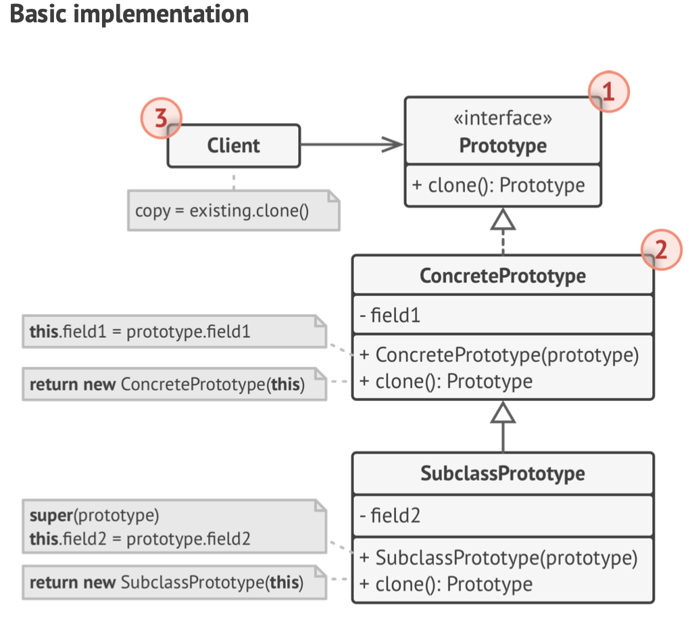

# Creational Design Patterns (4) - Prototype

- Prototype is a creational design pattern that lets you copy existing objects without making your code dependent on their classes
- This interface lets you clone an object without coupling your code to the class of that object. Usually, such an interface contains just a single ```clone``` method
- An object that supports cloning is called a prototype. When you objects have dozens of fields and hundreds of possible configurations, cloning them might serve as an alternative to subclassing
- Here's how it works: you create a set of objects, configured in various ways. When you need an object like the one you've configured, you just cloned a prototype instead of constructing a new object from scratch
- Here's the structure of Prototype:


- Here's what I coded following along the Pseudocode:
```python
import copy
from abc import ABC, abstractmethod


class Shape(ABC):
    def __init__(self, source=None):
        if source:
            self.x = source.x
            self.y = source.y
            self.color = source.color
        else:
            self.x = 0
            self.y = 0
            self.color = "White"

    def clone(self):
        return copy.deepcopy(self)

    @abstractmethod
    def area(self):
        pass

    @abstractmethod
    def perimeter(self):
        pass

    def __str__(self):
        return f"{self.__class__.__name__}(x: {self.x}, y: {self.y}, color: {self.color})"


class Circle(Shape):
    def __init__(self, source=None):
        super().__init__(source)
        if source:
            self.radius = source.radius
        else:
            self.radius = 1

    def area(self):
        return (self.radius ** 2) * 3.14

    def perimeter(self):
        return self.radius * 2 * 3.14


class Rectangle(Shape):
    def __init__(self, source=None):
        super().__init__(source)
        if source:
            self.width = source.width
            self.height = source.height
        else:
            self.width = 1
            self.height = 1

    def area(self):
        return self.width * self.height * 0.5

    def perimeter(self):
        pass


# Usage
circle = Circle()
circle.x = 5
circle.y = 7
circle.color = "Blue"
circle.radius = 10

rec = Rectangle()
rec.x = 2
rec.y = 3
rec.color = "Red"
rec.width = 4
rec.height = 6

circle_clone = circle.clone()
circle_clone.radius = 20
circle_clone.color = "Black"
rec_clone = rec.clone()
rec_clone.width = 10
rec_clone.height = 15
rec_clone.color = "Black"

print(f"Original circle: {circle}")
print(f"Original circle area: {circle.area()}")
print(f"Clone circle: {circle_clone}")
print(f"Clone circle area: {circle_clone.area()}")

print(f"Original rectangle: {rec}")
print(f"Clone rectangle: {rec_clone}")
```

## Applicability:
- Use the Prototype pattern when your code shouldn't depend on the concrete classes of objects that you need to copy
    * This happens a lot when your code works with objects passed to you from 3rd-party code via some interface. The concrete classes of these objects are unknown, and you couldn't depend on them even if you wanted to 
    * The Prototype pattern provides the client code with a general interface for working with all objects that support cloning. This interface makes the client code independent from the concrete classes of objects that it clones
- Use the pattern when you want to reduce the numner of subclasses that only differ in the way they initialize their respective objects. 
    - For example: Shapes can have many subclasses such as Circles, Squares, Pentagon, etc. To reduce this, Shapes can have ```sources``` as its attributes then have ```clone``` class to have different shapes that developers can adjust the attributes or add more states to it

## Pros and Cons
### Pros
- You can clone objects without coupling to their concrete classes
- You can get rid of repeated initialization code in favor of cloning pre-built prototypes
- You can produce complex objects more conveniently
- You get an alternative to inheritance when dealing with configuration presets for complext objects

### Cons
- Cloning complex objects that have circular references might be very tricky.

---

I also did a small researc about Shallow Copy vs. Deep Copy when learning about this concept
