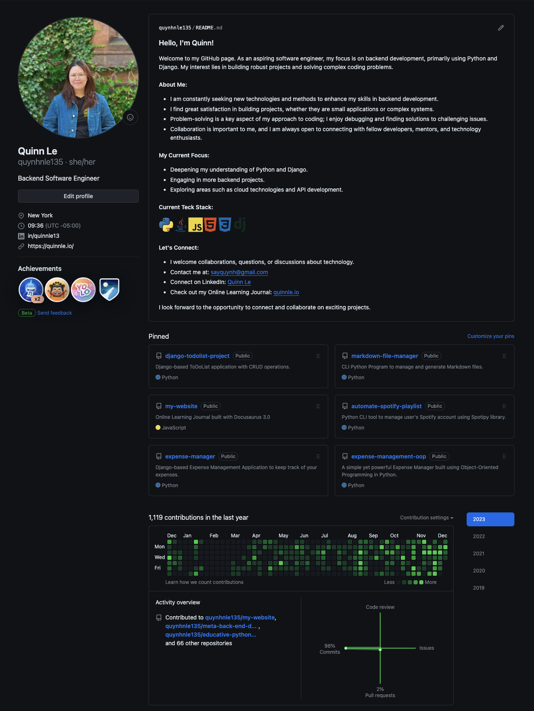

# Tips to use Github as your Portfolio

- Although it's not mandatory, it's common for recruiters to want to see your Github and sometimes also ask for a Portfolio, so why not combine two by updating your Github?
- Github is an ideal place because you can showcase examples of your code, your progress, your studies, and initiatives you've been involved in

## 1. Update your README
- Sart with your homepage on Githuu: The README
- How to do it:
    * Create new repository
    * The name of this new repository has to be your Github username &rarr; It will show you special message with a cat gif to notify that you're create a repository to update your homepage's README
    * Make sure you check the box for Add a README file
    * Create the repository
- What do I put here:
    * Short bio, skills, social media
    * I use [Profileme.dev](https://www.profileme.dev/) to include logos for my tech stack

## 2. Fill in the Left column
- You can fill in your profile with basic in information:
    * Your name
    * Your pronoun
    * A short bio: your title, or aspiration
    * Where you work or study
    * Include social medial link

## 3. Pin projects
- You should pinn important projects that you want to highlight you skills and achievements. 
- For those projects, make sure to write short description and include technologies used.

---

#### Here is what my Github's homepage look like after updating:

---

You can read the full article [here](https://dev.to/pachicodes/tips-to-use-github-as-your-portfolio-4kb2?ref=dailydev)